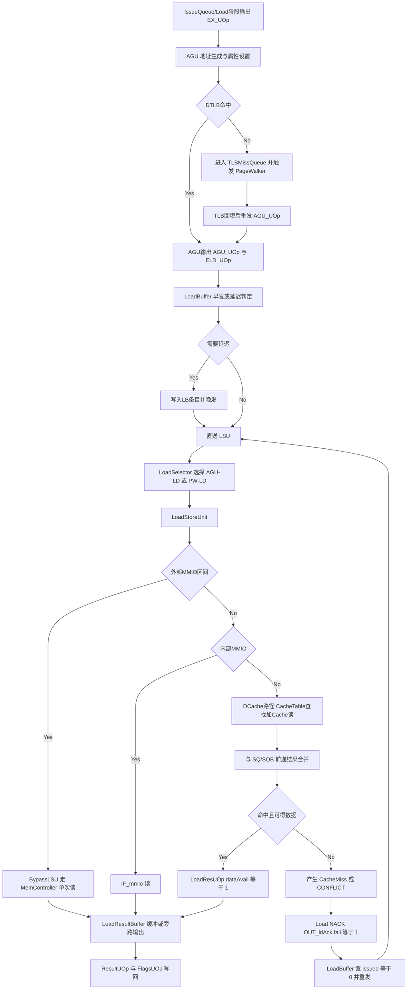
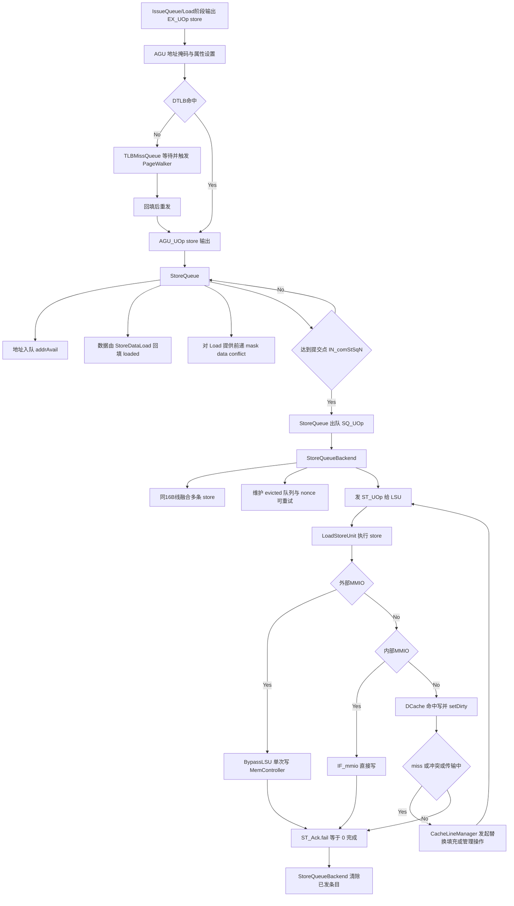
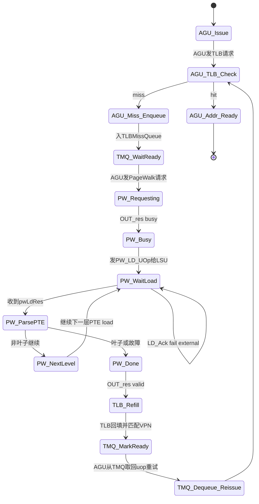

# D内存子系统与MMU

## 0. 范围与结论

目标：

1. 讲清 `Load` / `Store` 从地址生成到访存返回全链路
2. 讲清 `store-to-load forward`、重放（replay）、提交后写存储
3. 讲清 DTLB miss 与 `PageWalker` 协同

依据文档与代码：

- 文档：
  - [docs/Overview.zh.md](Overview.zh.md)
  - [docs/名词解释.md](名词解释.md)
  - [docs/体系结构阅读顺序.md](体系结构阅读顺序.md)
- 代码：
  - [src/AGU.sv](../src/AGU.sv)
  - [src/LoadBuffer.sv](../src/LoadBuffer.sv)
  - [src/StoreQueue.sv](../src/StoreQueue.sv)
  - [src/StoreQueueBackend.sv](../src/StoreQueueBackend.sv)
  - [src/LoadStoreUnit.sv](../src/LoadStoreUnit.sv)
  - [src/LoadSelector.sv](../src/LoadSelector.sv)
  - [src/LoadResultBuffer.sv](../src/LoadResultBuffer.sv)
  - [src/BypassLSU.sv](../src/BypassLSU.sv)
  - [src/TLB.sv](../src/TLB.sv)
  - [src/TLBMissQueue.sv](../src/TLBMissQueue.sv)
  - [src/PageWalker.sv](../src/PageWalker.sv)
  - [src/CacheReadInterface.sv](../src/CacheReadInterface.sv)
  - [src/CacheWriteInterface.sv](../src/CacheWriteInterface.sv)
  - [src/CacheLineManager.sv](../src/CacheLineManager.sv)
  - [src/DataPrefetch.sv](../src/DataPrefetch.sv)
  - [src/PrefetchPatternDetector.sv](../src/PrefetchPatternDetector.sv)
  - [src/PrefetchIssuer.sv](../src/PrefetchIssuer.sv)
  - [src/PrefetchExecutor.sv](../src/PrefetchExecutor.sv)

---

## 1) Load路径图

### Load链路关键点

- 地址与访存属性在 `AGU` 形成：`size`、`signExtend`、`loadSqN/storeSqN`、异常标志。
- `LoadBuffer` 负责“立即发射 vs 延迟发射”，并承接 NACK 后重发。
- `LoadStoreUnit` 做三路：DCache、内部 MMIO、外部 MMIO(`BypassLSU`)。
- `StoreQueue`+`StoreQueueBackend` 转发与缓存数据合并后，进入 `LoadResultBuffer` 写回。

### Load流程图逐步介绍

1. **A→B：生成地址与基本访存属性**  
   `Load` 微操作进入 `AGU`，计算 `addr=srcA+srcB`，并根据 opcode 生成访存宽度、符号扩展、序号等元信息。

2. **B→C：先过 DTLB**  
   进入 `DTLB` 查询虚实地址映射。命中则继续；未命中则进入 miss 处理支路。

3. **C(Yes)→D：翻译成功，形成可执行请求**  
   `AGU` 输出 `AGU_UOp`（完整 load 请求）和 `ELD_UOp`（早期地址信息，供后续缓存路径使用）。

4. **C(No)→C1→C2→D：miss 排队并重试**  
   未命中请求先放入 `TLBMissQueue`，`PageWalker` 完成页表遍历后回填 TLB；对应请求被重新取出并回到可执行路径。

5. **D→E→E1：LoadBuffer 做“现在发 or 稍后发”决策**  
   `LoadBuffer` 判断是否可直接发给 LSU。典型“需延迟”情况：MMIO/非推测访问、早发失败、与同拍 store 有潜在字节冲突。

6. **E1(No)→F 与 E1(Yes)→E2→F：统一汇入 LSU 输入**  
   - 直接可发：直送 LSU。  
   - 延迟路径：先入 LB 条目，等条件满足再发。  
   两条路径最终都在 LSU 汇合。

7. **F→G→H：LoadSelector 统一仲裁来源**  
   `LoadSelector` 在 AGU 普通 load 与 PageWalker 外部 load 之间做选择，输出统一 `LD_UOp` 给 `LoadStoreUnit`。

8. **H→I/K：按地址空间分流**  
   - 外部 MMIO：走 `BypassLSU`，直接通过 `MemController` 访问。  
   - 内部 MMIO：走 `IF_mmio`。  
   - 普通内存：走 DCache 路径。

9. **M→N→O：DCache 数据与 Store 前递数据合并**  
   DCache 返回的数据会与 `SQ/SQB` 的前递字节按掩码融合。若可获得完整结果，则成功；否则进入 miss/conflict 处理。

10. **O(No)→Q→Q1→Q2→F：失败重放（Replay）**  
    出现 `CacheMiss`、传输冲突、前递冲突等情况时，LSU 给出 `NACK`，LB 将该条目标记为可重发，再次送往 LSU。

11. **O(Yes)→P→R→S：结果缓冲并写回**  
    完整数据形成 `LoadResUOp`，进入 `LoadResultBuffer`，最终输出 `ResultUOp/FlagsUOp` 写回并通知提交链路。

---

## 2) Store路径图

### Store链路关键点

- `StoreQueue` 分离“地址就绪”和“数据就绪”，并以 `storeSqN` 保证提交前后边界。
- **提交后写存储**：仅提交到 `IN_comStSqN` 范围内的 store 才能从 `StoreQueue` 流入 `StoreQueueBackend`。
- `StoreQueueBackend` 做融合（同 16B cache line）+ 重试（`nonce` + `ST_Ack.fail`）。

### Store流程图逐步介绍

1. **A→B：AGU 生成 store 地址与写掩码**  
   store 在 `AGU` 中确定 `addr`、`wmask`、宽度及顺序字段（`sqN/storeSqN/loadSqN`）。

2. **B→C：DTLB 翻译检查**  
   与 load 类似，先做地址翻译。命中继续，未命中走 miss 队列与页表遍历。

3. **C(No)→C1→C2→D：翻译完成后回到主路径**  
   miss 请求在翻译完成后重放，最终得到可执行的 `AGU_UOp(store)`。

4. **D→E：进入 StoreQueue（提交前缓冲）**  
   `StoreQueue` 分开维护地址和数据：地址先到可先占位，数据稍后由 `StoreDataLoad` 补齐。

5. **E1/E2/E3：StoreQueue 的三件事**  
   - `E1` 地址入队（`addrAvail`）  
   - `E2` 数据回填（`loaded`）  
   - `E3` 对后续 load 做字节前递并报告冲突

6. **E→F：检查是否跨过提交点**  
   只有到达 `IN_comStSqN` 的 store 才允许出队。未提交 store 保持在 SQ，仍可参与前递。

7. **F(Yes)→G→H：提交后移交 SQB**  
   `StoreQueueBackend` 接手“已提交 store”，负责融合与落地调度。

8. **H1/H2：融合与可重试机制**  
   - 同一 16B line 的多条写可融合，提高带宽利用。  
   - 用 `nonce` 区分重发轮次，结合 `ST_Ack` 判定成功或重试。

9. **H→I→J：发给 LSU 执行实际写入**  
   LSU 对已提交 store 做真正写操作（cache 或 MMIO）。

10. **J→K/M：按地址类型分流写路径**  
    - 外部 MMIO：`BypassLSU` 直接写总线。  
    - 内部 MMIO：`IF_mmio` 写设备寄存器。  
    - 普通内存：走 DCache 写，并置脏位（`setDirty`）。

11. **O→P：命中则完成；miss/冲突则补线后重试**  
    若 DCache 未命中或与当前 transfer 冲突，`CacheLineManager` 发起替换/填充/管理操作，再回到 LSU 重做该 store。

12. **R→S：确认完成并清理后端条目**  
    `ST_Ack.fail=0` 后，SQB 清除对应条目；失败则保留并再次调度。

---

## 3) store-to-load forward / 重放 / 提交后写存储

## 3.1 Store-to-Load Forward

- 前递来源分两层：
  - `StoreQueue`（提交前 store）
  - `StoreQueueBackend`（已提交、待落地 store）
- `LoadStoreUnit` 中将两路前递合并：优先采用 `SQ` 字节掩码覆盖，再与 cache/MMIO 数据拼接。
- 若遇到“地址命中但 store 数据未到”（`loaded=0` 且读掩码相交），标记 `conflict`，该 load 不可完成。

## 3.2 重放（Replay）

系统有两类“重放/回退”：

1. **局部重发（Load NACK）**
   - `LoadStoreUnit` 发现 `CONFLICT`、cache 访问失败、传输冲突、LRB不就绪等，发 `OUT_ldAck.fail=1`。
   - `LoadBuffer` 收到后将对应条目标记 `issued=0`，等待再次发射。

2. **内存顺序误推测全局回退（Mem-order flush）**
   - `LoadBuffer` 监测到“先前已发射 load 被更老 store 命中地址覆盖”时，产生 `OUT_branch`，`cause=FLUSH_MEM_ORDER`。
   - 触发流水线回退到 store 之后重新执行，修正乱序 load 误推测。

## 3.3 提交后写存储（Post-Commit Store）

- Store 执行与“提交”解耦：
  - 提交前：在 `StoreQueue` 持有并参与前递。
  - 提交后：出队到 `StoreQueueBackend`，再异步写 DCache/MMIO。
- 这样保证：
  - 架构可见顺序由 ROB/提交点控制；
  - 物理写回可延后并融合，提升写带宽利用率；
  - 分支回滚时无需撤销“已提交后才发射”的 store。

---

## 4) TLB miss 到 PageWalker 回填状态图

### 协同要点

- AGU：检测 miss、启动 page walk、将 miss uop 入 `TLBMissQueue`。
- `PageWalker`：通过 LSU 发起“外部 load 语义”的 PTE 读取（`doNotCommit=1`, `tagDst=TAG_ZERO`）。
- TLB：收到 `PageWalk_Res` 后回填表项。
- `TLBMissQueue`：监听 `IN_pw.valid`，把 VPN 匹配的挂起请求标记 ready，再重新送回 AGU。

### 状态图逐步介绍（TLB miss → PageWalker → 回填）

1. **AGU_Issue → AGU_TLB_Check**  
   AGU 对当前访存发起 TLB 查询。

2. **命中分支：AGU_TLB_Check → AGU_Addr_Ready**  
   直接得到物理地址，流程结束。

3. **未命中分支：AGU_TLB_Check → AGU_Miss_Enqueue → TMQ_WaitReady**  
   miss 请求进入 `TLBMissQueue`，等待翻译结果。

4. **TMQ_WaitReady → PW_Requesting**  
   AGU 侧拉起 page walk 请求，`PageWalker` 进入工作态。

5. **PW_Requesting → PW_Busy → PW_WaitLoad**  
   `PageWalker` 通过 LSU 发出页表项读取 load（这是“外部/不提交”语义的特殊 load）。

6. **PW_WaitLoad 自循环（NACK）**  
   若 LSU 暂时无法接收，收到 `LD_Ack fail external`，`PageWalker` 会重发该 load。

7. **PW_WaitLoad → PW_ParsePTE**  
   收到页表项数据后解析 PTE：合法性、叶子判断、权限位/异常位。

8. **两级页表继续：PW_ParsePTE → PW_NextLevel → PW_WaitLoad**  
   若当前不是叶子且仍需下一层，计算下一层地址并继续发起 load。

9. **终止条件：PW_ParsePTE → PW_Done → TLB_Refill**  
   到达叶子或判定 fault，`PageWalker` 产生 `PageWalk_Res`。

10. **TLB_Refill → TMQ_MarkReady**  
    TLB 回填后，TMQ 将 VPN 匹配的挂起请求标成 ready。

11. **TMQ_MarkReady → TMQ_Dequeue_Reissue → AGU_TLB_Check**  
    挂起请求被取出重试，重新进行 TLB 检查（通常这次命中），恢复正常执行路径。

---

## 5) 风险点

| 风险点 | 触发条件 | 影响 | 当前设计中的缓解机制 | 残余风险 |
|---|---|---|---|---|
| 内存顺序误推测（Store覆盖已执行Load） | load 先执行，后到达的更老 store 地址重叠 | 读到旧值，违反程序顺序 | `LoadBuffer` 检测冲突并发 `FLUSH_MEM_ORDER` 回退 | 冲突检测粒度按字节掩码，极端高冲突代码回退频繁 |
| Store数据未就绪导致Load误读 | 地址已知但 store data 尚未写入 SQ 条目 | 若不拦截会产生脏读 | SQ 前递输出 `conflict`，LSU 对 load NACK 重发 | 高频 store-data 延迟会放大 replay 开销 |
| MMIO旁路与缓存路径语义差异 | 地址落 MMIO 区，绕过 DCache | 排序/可见性与普通 cache 访存不同 | 非推测/顺序化路径（LB nonSpec + LSU/BLSU 分流） | 外设侧时序波动可能引入额外 stall |
| Cache miss/替换冲突 | miss 地址与正在进行 transfer 冲突 | 重复 miss、反复失败重试 | `CacheLineManager` 的 `missEvictConflict` 与 `OUT_missReady` 仲裁 | 高并发下 miss 饥饿风险上升 |
| TLB miss风暴 | 多AGU连续 miss 同页或近页 | TMQ/LSU 资源占用、延迟陡增 | TMQ排队 + PageWalker 串行处理 + TLB回填后批量ready | 注释中已提示“可能双插入同页miss”需进一步去重 |

---

## 6) 结语

该内存子系统采用“**推测执行 + 提交边界 + 回退/重发**”组合：

- Load 尽量早发，失败则局部 replay 或全局 mem-order flush；
- Store 在提交后异步落地，并在 SQ/SQB 双层前递保证读后写可见性；
- DTLB miss 通过 TMQ + PageWalker + TLB 回填闭环恢复。
