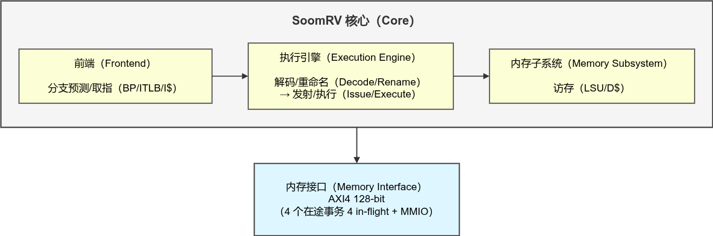
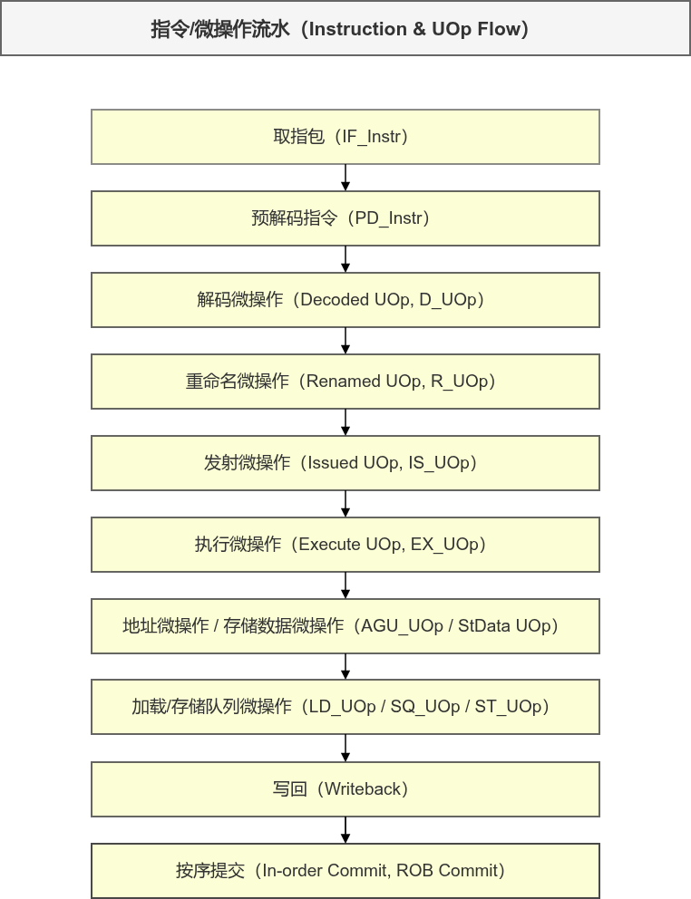
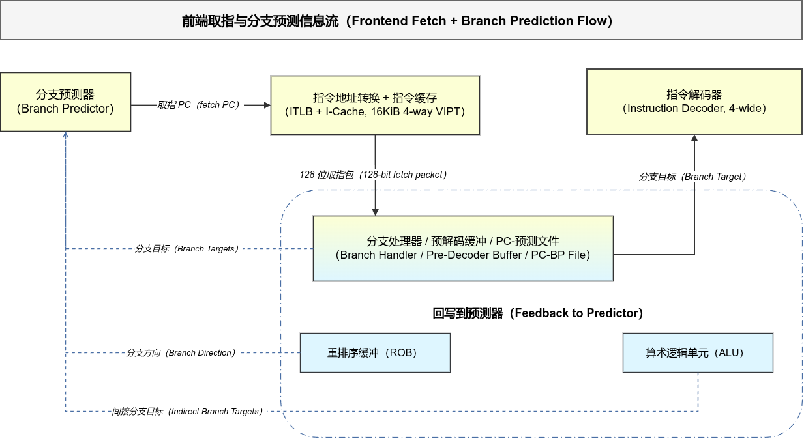
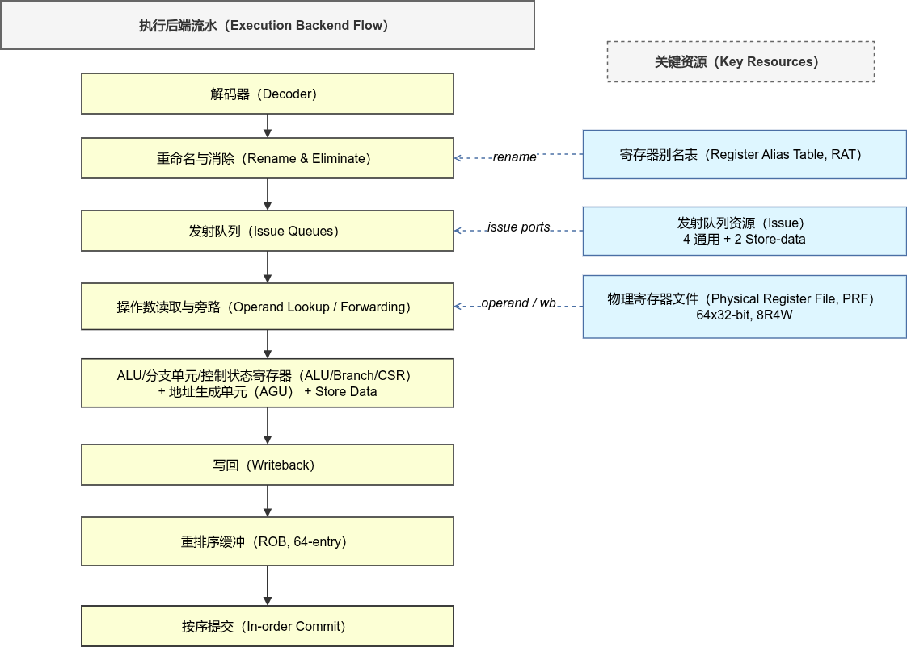
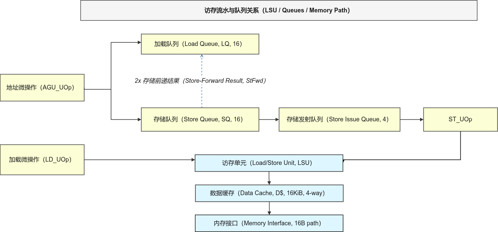
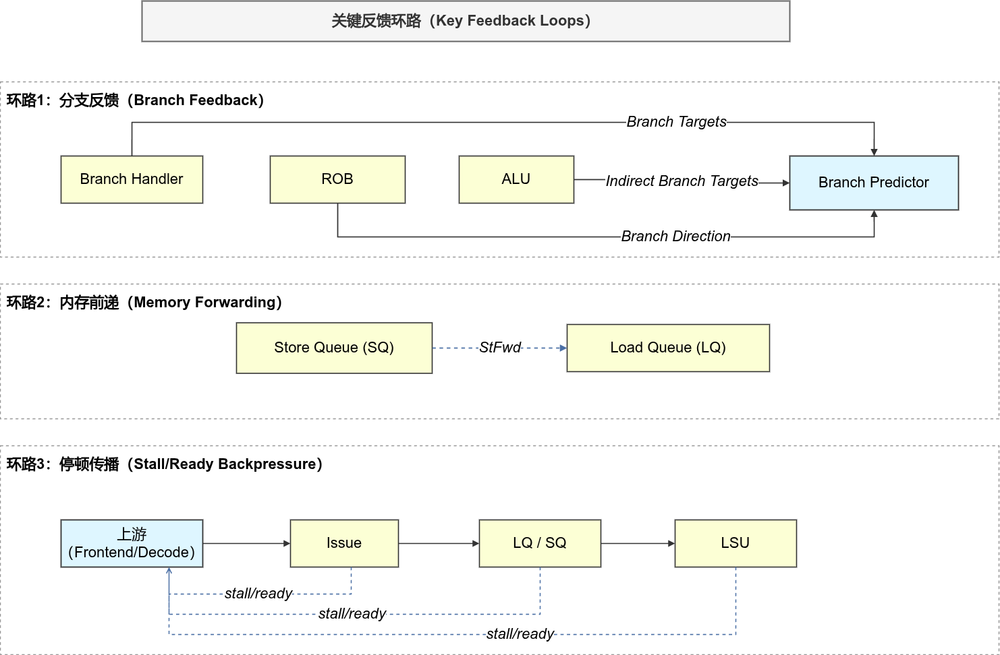

# SoomRV 全局总干

---

## 架构总览（Architecture Overview）

- 这是一个四发射（4-wide）、乱序执行（Out-of-Order, OoO）的 RISC-V 核。
- 四大分区：前端（Frontend）、执行引擎（Execution Engine）、内存子系统（Memory Subsystem）、内存接口（Memory Interface）。
- 规格：重排序缓冲（Re-Order Buffer, `ROB`）64 项，加载/存储队列（Load/Store Queue, `LQ/SQ`）各 16 项，指令/数据缓存（I/D Cache）16KiB 4 路组相联（4-way VIPT），AXI4 128-bit。

SoomRV 是四路超标量、乱序执行内核。前端负责取指和预测，执行引擎负责重命名、发射和执行，内存子系统负责 load/store 排队与访问。内存接口通过 AXI4 与外部内存和设备通信。

---

## 主线数据流（Main Dataflow: IF_Instr -> Commit）

- `R_UOp`：完成逻辑寄存器到物理寄存器映射，并绑定序列号（SqN）。
- `EX_UOp`：源操作数就绪，可直接进入功能单元执行。
- 访存类指令在执行后分叉为地址流（AGU_UOp）和数据流（StData UOp），最终在访存单元（LSU）与提交路径收口。

指令从 IF_Instr 开始，经过预解码、解码、重命名、发射和执行，最后写回并由 ROB 按序提交。每个模块本质上都是“数据结构转换器”，把上一阶段格式转成下一阶段可使用的格式。

---

## 前端闭环（Frontend Loop）

- 前端输出不仅有指令字节流，还有 PC 与预测元数据（PC/BP File）。
- 预解码缓冲（Pre-Decoder Buffer）负责指令边界切分，向解码器提供 `4x PD_Instr`。
- 分支预测更新是三源反馈：取指早期修正、提交阶段校正、执行阶段间接分支目标补充。

前端过程中，预测器给 PC，I-Cache 返回 128-bit 取指包，再分流到分支处理、预解码和 PC/BP 元数据。三源反馈：Branch Handler、ROB、ALU 共同更新预测器，持续修正前端路径。

---

## 中后段主干（Rename/Issue/Execute/Commit）

- 重命名（Rename）建立真实依赖并分配物理资源，支撑 OoO 执行。
- 发射 + 旁路（Issue + Forwarding）决定何时可发射、是否可绕过回写等待。
- 执行可以乱序完成，提交必须按序，由 ROB 保证精确异常（Precise Exception）。

中后段核心是“乱序执行，按序提交”。重命名先处理依赖，IssueQueue 只发射就绪指令，Forwarding 解决短期数据相关。即使执行完成顺序不同，ROB 仍按程序顺序提交，保证异常与架构状态一致。

---

## 访存闭环（Memory Loop: AGU/LQ/SQ/LSU/Cache）

- Load 和 Store 在队列层拆分管理，Store 地址与数据在 SQ 汇合。
- 存储到加载前递（Store-to-Load Forwarding）是访存关键优化路径。
- LSU 处理命中/未命中（hit/miss）和请求仲裁，miss 通过内存接口回填。

AGU 先算地址，load/store 分别入队；store 提交后进入 Store Issue Queue 发射。Load 优先尝试 SQ 前递命中，命中就绕过 cache 慢路径。若 miss，则由 LSU 发起外部请求并等待回填，这就是访存闭环。

---

## 三条反馈环（Three Feedback Loops）

- 分支反馈环：降低错误路径成本，提升预测质量。
- 前递反馈环：降低数据相关导致的访存等待。
- 停顿传播环：通过 `stall/ready` 握手把拥塞向上游传播，避免局部堵塞扩散成全局失稳。

这三条环路解释系统为什么稳定。第一，分支反馈持续修正前端路径；第二，存储前递优先复用最新数据；第三，通过 stall/ready 把拥塞向上游传播，系统自动减速并在资源恢复后继续推进。

---

## 总结（Summary）

SoomRV 全局主干（Global Backbone）

1) 主线（Main Pipeline）指令如何完成：IF -> Decode -> Rename -> Issue -> Execute -> Commit
2) 分支闭环（Branch Loop）错误路径如何纠正：三源反馈修正前端
3) 访存闭环（Memory Loop）内存等待如何保持正确与吞吐：LQ/SQ/LSU + miss + 回填
4) 停顿传播（Stall/Ready Loop）系统如何在压力下稳定运行：拥塞上推，节拍自稳

简单来说：主线是从取指到按序提交；分支预测依靠多源反馈持续修正；访存通过 LQ/SQ/LSU 处理前递、miss 与回填；系统通过 stall/ready 停顿传播维持整体稳定。

---

## 术语速查（Glossary）

- 前端（Frontend）：分支预测、取指、预解码相关模块。
- 执行引擎（Execution Engine）：重命名、发射、执行、写回和提交控制。
- 内存子系统（Memory Subsystem）：LQ/SQ/LSU/Cache 组成的访存路径。
- 重排序缓冲（ROB）：保证按序提交与精确异常。
- 寄存器别名表（RAT）：逻辑寄存器到物理寄存器映射。
- 物理寄存器文件（PRF）：保存物理寄存器值，支持多端口读写。
- 停顿传播（stall/ready 反压）：下游拥塞时，上游通过握手信号减速或停发。
