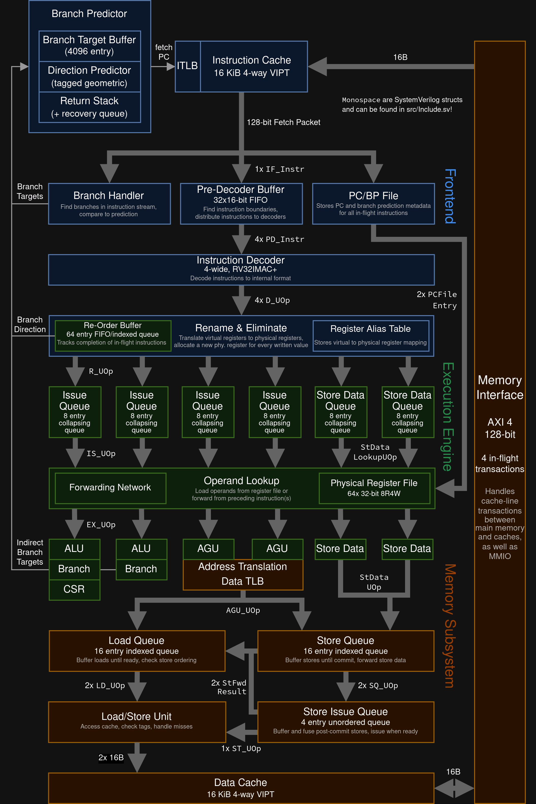

# SoomRV

## 项目描述

SoomRV 是一个简单的超标量乱序 RISC-V 核心，能够每个周期执行多达 4 条指令，并且能够启动 Linux。请查看最新的 CI 日志以查看 Linux 启动日志！

有关在 FPGA 上运行 SoomRV，请查看 [SoomRV-Arty 仓库](https://github.com/mathis-s/SoomRV-Arty)。

## 基本架构

### 架构详细说明

SoomRV 采用超标量乱序执行架构，每个周期最多可以执行 4 条指令。以下是各个主要模块的详细介绍：

#### 1. 前端取指阶段 (Frontend)

**指令获取单元 (IFetch)**

- **16字节取指带宽**：每个周期可以从指令缓存中获取最多 16 字节的指令数据
- **分支预测**：集成 TAGE (Tagged Geometric History Length) 方向预测器，预测分支跳转行为
- **返回栈**：可恢复的返回地址栈，优化函数调用和返回操作
- **PC文件 (PCFile)**：存储每个取指束的程序计数器信息，用于错误预测恢复

**预解码单元 (PreDecode)**

- 将获取的指令束拆分成独立的 16/32 位 RISC-V 指令
- 根据指令的低两位判断指令长度
- 分发指令到不同的解码端口

#### 2. 指令解码与重命名阶段 (Decode & Rename)

**指令解码器 (InstrDecoder)**

- 将 RISC-V 指令格式解码为 SoomRV 内部微操作格式
- 提取操作码、操作数、立即数等关键信息
- 识别特殊指令（如 NOP、立即数加载）进行优化

**重命名单元 (Rename)**

- **标签分配**：为每条指令的目标寄存器分配唯一的物理标签
- **寄存器重命名**：将虚拟寄存器映射到物理寄存器，消除伪依赖
- **指令消除**：在重命名阶段直接执行简单指令（如 NOP、小立即数加载）
- **序列号分配**：为每条指令分配唯一的序列号用于排序

#### 3. 调度与执行阶段 (Scheduler & Execution)

**发射队列 (IssueQueue)**

- 存储重命名后的指令，等待操作数和功能单元就绪
- **乱序发射**：一旦指令的操作数和执行单元就绪，即可发射执行
- **多队列支持**：支持指令分布到多个发射队列，提高并行度
- **标签跟踪**：使用标签跟踪操作数可用性

**加载单元 (Load)**

- 在指令发射后加载操作数值
- **寄存器文件访问**：从物理寄存器文件读取操作数
- **前向转发**：处理操作数前向传递，减少数据冒险
- **立即数优化**：支持直接使用立即数作为操作数

**执行单元 (Execution Units)**

- **整数ALU**：执行算术逻辑运算、分支判断
- **地址生成单元 (AGU)**：计算内存访问地址，执行地址转换
- **浮点单元 (FPU)**：使用 HardFloat 库实现浮点运算
- **分支处理**：专门的分支执行单元，处理分支目标计算和方向判断

#### 4. 内存子系统 (Memory Subsystem)

**加载缓冲 (LoadBuffer)**

- 存储已执行但未提交的加载指令
- **依赖检测**：检测加载顺序错误预测，处理内存依赖
- **延迟加载**：支持延迟执行的加载操作

**存储队列 (StoreQueue)**

- 存储已执行的存储指令
- **数据转发**：向加载操作转发存储数据
- **内存别名检查**：确保内存访问的正确性

**存储队列后端 (StoreQueueBackend)**

- 融合存储操作，优化内存访问
- **16字节对齐**：将相同 16 字节区域的存储操作融合
- **提交后执行**：存储在提交后执行，避免回滚复杂性

**加载存储单元 (LoadStoreUnit, LSU)**

- 底层内存访问接口
- **缓存访问**：直接访问 L1 数据缓存
- **缺失处理**：处理缓存缺失，访问下级存储层次
- **MMIO处理**：支持内存映射 I/O 设备访问

**旁路加载存储单元 (BypassLSU)**

- 专门处理外部 MMIO 设备
- **直接通信**：绕过缓存，直接与内存控制器通信
- **缓存旁路**：支持未来实现绕过缓存的常规内存访问

#### 5. 提交与恢复阶段 (Commit & Recovery)

**重排序缓冲区 (ROB)**

- **指令跟踪**：跟踪所有重命名后的指令执行状态
- **顺序提交**：确保指令按程序顺序提交，维护架构状态
- **异常处理**：处理精确异常，支持操作系统需求
- **错误预测恢复**：在错误预测时恢复处理器状态

**分支处理**

- **错误检测**：在执行阶段检测分支预测错误
- **状态重置**：触发全局分支信号，清除错误路径上的指令
- **状态恢复**：从 ROB 重放正确路径的指令，恢复重命名状态

#### 6. 存储层次结构 (Memory Hierarchy)

**指令缓存 (I-Cache)**

- VIPT (Virtually Indexed Physically Tagged) 缓存
- 16 字节取指行，优化指令获取效率

**数据缓存 (D-Cache)**

- VIPT 缓存，支持双端口访问
- 每周期支持 2 次加载操作
- 与存储队列紧密集成

**内存控制器 (MemoryController)**

- 处理缓存与主存之间的数据传输
- 32 位双向内存总线接口
- 计划升级为标准 Wishbone 或 AXI 总线

#### 7. 关键设计特性

**标签索引寄存器文件**

- 使用标签作为寄存器索引，提高重命名效率
- 支持推测执行期间的寄存器状态管理

**推测执行机制**

- 指令在依赖关系满足前即可发射
- 错误推测时通过 ROB 进行状态恢复
- 序列号机制确保指令顺序的正确追踪

**乱序执行优化**

- 4 路超标量并行执行
- 多发射队列提高指令级并行性
- 动态调度最大化处理单元利用率

这种架构设计使得 SoomRV 能够在保持 RISC-V 架构兼容性的同时，实现高性能的乱序执行能力，成功支持 Linux 操作系统运行。

## `strcmp` 执行示例（使用 [Konata](https://github.com/shioyadan/Konata) 可视化）

## 功能特性

- RV32IMAC+ 指令集
- 4 路超标量乱序执行（标签索引寄存器文件，发射后加载）
- 实现 RISC-V 特权规范（M/S/U 模式，虚拟内存，可启动 Linux）
- IFetch：16 字节获取，TAGE 方向预测器，可恢复返回栈
- 内存：每周期 2 次加载，VIPT 缓存，延迟存储数据聚合，通过内存的依赖跟踪
- 默认配置在 5.42 CoreMark/MHz 和 4.0 到 11.8 DMIPS/MHz 之间评分，具体取决于编译器标志（见 CI）。

## 仿真

1. 安装 [RV32 Linux 工具链](https://github.com/riscv-collab/riscv-gnu-toolchain) 以及 Verilator（至少版本 5.0）。
2. 运行 `make setup` 来构建子模块。
3. 运行 `make` 来使用 Verilator 构建二进制文件（另外，`make trace` 也会生成 VCD 跟踪）。
4. 要运行裸机代码，使用 `./obj_dir/VTop <汇编文件>` 或 `<裸机 elf 文件>`。
   例如，运行 `./obj_dir/VTop test_programs/dhry_1.s` 来运行 Dhrystone。可选择添加 `--perfc` 来打印性能计数器，或 `-x <开始时间>` 来指定何时启用跟踪（`-x0` 表示从开始跟踪）。
5. 要运行 Linux，使用 `./obj_dir/VTop --perfc --device-tree=test_programs/linux/device_tree.dtb test_programs/linux/linux_image.elf`（或 `make linux` 进行完整构建）。以 `root` 身份登录，无需密码。
   在仿真中构建 Linux 和启动它至少需要几个小时！

### 控制台

控制台输入是行缓冲的，以便在低仿真速度下更容易输入。在 Linux 内中，
您因此会看到所有输入行两次。

### 保存/恢复（实验性）

在运行时，如果指定了 `--backup-file=<NAME>.backup`，模拟器大约每分钟会保存一次其状态。然后可以通过运行 `./obj_dir/VTop <NAME>.backup` 在备份处重新启动仿真。文件名必须以 `.backup` 结尾。如果启用了 cosim，匹配的 `.backup_cosim` 文件也会被写入/读取。

这在 `make linux` 中默认启用。要在最后一个检查点重新启动崩溃或关闭的 Linux 引导，例如使用 `./obj_dir/VTop soomrv.backup --backup-file=soomrv2.backup`。
（在 Verilator 生成的代码中似乎有一些虚假的核心转储。）

## 文档

有关实现的一般概述，请参见 [概述](Overview.zh.md)。

## 许可证

SoomRV 在 MIT 许可证下发布。此源代码的使用受可以在 `LICENSE` 文件中找到的 MIT 风格许可证约束。

### 外部源代码

- `riscv-isa-sim`（又名 `Spike`）：在 3-Clause BSD 许可证下发布，与模拟器结合使用。
- `hardfloat`：在 3-Clause BSD 许可证下发布。
